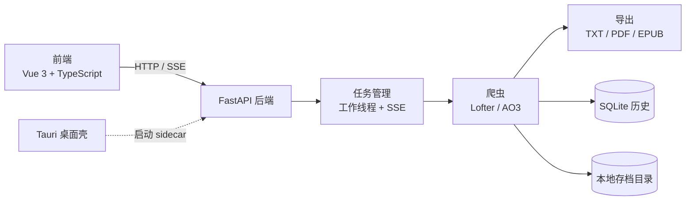

<p align="center">
  
</p>

<h1 align="center">LoArchive</h1>

<p align="center">
  一站式保存你喜欢的同人作品<br>
  支持 Lofter 与 AO3 的内容存档工具
</p>

<p align="center">
  <a href="https://github.com/Yar1991-Translation/LoArchive/releases"></a>
  <a href="https://github.com/Yar1991-Translation/LoArchive/actions/workflows/test.yml"></a>
  
  
  
</p>

---

## 简介

LoArchive 是一个在本机运行的图形化存档工具，用于把 Lofter 与 AO3 上的作品保存到本地。提供安装版桌面应用，也可以直接从源码启动 Web 界面。

所有抓取、解析与导出都在本地完成，不需要上传任何数据，也不依赖第三方服务。

## 架构



- 前端为 Vue 3 + Vite + TypeScript 单页应用，由 Tauri 应用内协议加载，浏览器模式下由后端托管构建产物
- 后端为 FastAPI 应用，任务以工作线程执行，日志与进度通过 SSE 实时推送；下载历史存储在 SQLite 中
- 桌面版由 Tauri 启动内嵌的 Python sidecar，并提供原生窗口与文件夹选择器

## 功能特性

### Lofter

| 功能 | 说明 |
| --- | --- |
| 喜欢 / 推荐 / Tag | 批量保存点过喜欢、推荐的内容，或指定 Tag 下的内容 |
| 他人喜欢 | 抓取其他用户公开的喜欢列表 |
| 作者图片 | 下载指定作者发布的所有图片 |
| 作者文章 | 保存指定作者的全部文章 |
| 单篇保存 | 保存单篇博客的图片或文章 |

### AO3

| 功能 | 说明 |
| --- | --- |
| 单篇作品 | 下载作品的全部章节 |
| 系列作品 | 批量下载整个系列 |
| 作者作品 | 下载某位作者的全部作品 |
| Tag 搜索 | 按 Tag 批量下载作品，可限制抓取页数 |

### 导出格式

| 格式 | 说明 |
| --- | --- |
| TXT | 始终保存，纯文本便于阅读与检索 |
| PDF | 书籍式排版、支持中文，Lofter 与 AO3 均可导出 |
| EPUB | 支持分章目录，仅 AO3 提供 |
| HTML | 导出 PDF 时一并保留的中间产物，便于自行调整排版 |

## 下载安装

### 方式一：桌面应用

从 [Releases](https://github.com/Yar1991-Translation/LoArchive/releases) 页面下载最新安装包：

| 系统 | 下载文件 |
| --- | --- |
| Windows | `LoArchive_<版本>_x64-setup.exe` |

双击安装即可使用，无需自行配置 Python 或 Node 环境。桌面版目前仅提供 Windows 安装包。

### 方式二：源码运行

环境要求：Python 3.11 及以上；Node.js 20 及以上（前端构建与桌面打包需要）。

```bash
git clone https://github.com/Yar1991-Translation/LoArchive.git
cd LoArchive

pip install -r requirements.txt
npm install
npm run build

python run.py
```

启动后访问 <http://localhost:5000> 即可使用。

## 快速开始

### 配置 Lofter 授权码

AO3 相关功能无需配置，可直接使用。Lofter 需要登录后才能访问大部分内容，按以下步骤获取授权码：

1. 打开 [Lofter](https://www.lofter.com) 并登录
2. 按 `F12` 打开开发者工具，切换到 `Application`（应用程序）标签
3. 左侧选择 `Cookies`，展开 `https://www.lofter.com`
4. 按下表找到你所用登录方式对应的值，复制完整内容

| 登录方式 | Cookie 名称 |
| --- | --- |
| 手机号登录 | `LOFTER-PHONE-LOGIN-AUTH` |
| Lofter ID 登录 | `Authorization` |
| QQ / 微信 / 微博登录 | `LOFTER_SESS` |
| 邮箱登录 | `NTES_SESS` |

5. 在应用的「设置」页面选择登录方式，粘贴授权码并保存

### 开始存档

1. 从左侧菜单选择功能模块
2. 填入要抓取的链接
3. 勾选需要的保存选项
4. 点击「开始」按钮，进度、运行日志与停止按钮都在底部任务坞中，任何页面可见
5. 内容保存在存档目录中，同时记入「下载历史」

## 使用说明

### Lofter 喜欢 / 推荐 / Tag

| 模式 | 链接填法 |
| --- | --- |
| 我的喜欢 | 个人主页，如 `https://yourname.lofter.com/` |
| 我的推荐 / 他人喜欢 | 对应的用户主页 |
| Tag 内容 | Tag 页面，如 `https://www.lofter.com/tag/某tag` |

Tag 链接可带排序后缀：`/new`（最新）、`/total`（总榜）、`/month`（月榜）、`/week`（周榜）、`/date`（日榜）。喜欢、推荐与 Tag 模式可选择只保存某个时间之后的内容。

### Lofter 作者内容

链接填写作者主页，如 `https://authorname.lofter.com/`。作者图片与作者文章分别对应两个面板，均可设置时间范围筛选。

### AO3 下载

链接填写作品、系列、作者作品页或 Tag 作品页的地址，支持一次粘贴多个链接（每行一个）。作者与 Tag 模式可限制最大抓取页数，并可选择是否下载全部章节、是否保存元数据，以及是否导出 PDF / EPUB。

## 项目结构

```text
LoArchive/
├── run.py                    启动入口
├── loarchive/                FastAPI 后端包
│   ├── main.py               应用工厂与 uvicorn 入口
│   ├── config.py             配置读写
│   ├── history.py            下载历史（SQLite，自动迁移旧 JSON）
│   ├── state.py              任务管理（线程、取消标志、SSE 事件）
│   ├── errors.py             异常层级
│   ├── logsetup.py           日志（控制台 + 滚动文件）
│   ├── schemas.py            请求 / 响应模型
│   ├── routers/              API 路由（config / tasks / files / history / meta）
│   ├── spiders/              爬虫实现（含 common 公共逻辑）
│   └── exporters/            PDF / EPUB 导出
├── frontend/                 Vue 3 + Vite + TypeScript 前端
│   └── src/                  组件 / 视图 / stores / API 层 / 主题令牌
├── scripts/                  构建、开发启动与版本同步脚本
├── src-tauri/                Tauri 桌面应用
├── tests/                    pytest 后端测试
├── tests-frontend/           vitest 前端测试
├── docs/                     API 契约与版本发布说明
└── dir/                      默认存档目录
```

## 开发

### 常用命令

```bash
# 安装开发依赖（后端 + 前端）
pip install -r requirements-dev.txt
npm install

# 一键启动后端与前端（带热更新，日常开发用这个）
npm run dev

# 桌面开发模式（自动启动后端与前端，打开 Tauri 窗口）
npm run tauri:dev

# 代码检查与格式检查
ruff check .
ruff format --check .

# 运行测试
pytest          # 后端
npm run test    # 前端
npm run typecheck

# 构建前端产物（浏览器模式需要）
npm run build

# 版本号同步（以 loarchive/__init__.py 为单一来源）
python scripts/sync_version.py
```

### 构建桌面应用

```bash
# 先构建后端 sidecar，再打包
python scripts/build_backend.py
npm run tauri:build
```

## 后端接口

完整契约见 [docs/api.md](docs/api.md)。

| 方法 | 路径 | 说明 |
| --- | --- | --- |
| GET | `/api/version` | 应用版本（前端展示与更新检查的单一来源） |
| GET / POST | `/api/config` | 读取或保存 Lofter 登录信息（读取时授权码遮蔽返回） |
| GET / POST | `/api/settings` | 读取或保存存档路径与开关项 |
| POST | `/api/task/start` | 启动任务，参数按任务类型校验（冲突返回 409） |
| GET | `/api/task/status` | 轮询任务状态（SSE 不可用时回退） |
| GET | `/api/task/events` | SSE 实时推送日志与进度 |
| POST | `/api/task/stop` | 请求停止当前任务 |
| GET | `/api/files` | 列出已下载文件 |
| GET | `/api/history` | 分页查询下载历史，支持类型、来源与关键词过滤 |
| POST | `/api/history/clear` | 清空下载历史 |
| DELETE | `/api/history/delete/{id}` | 删除单条历史记录（不存在返回 404） |
| POST | `/api/history/check` | 检查某个链接是否已下载 |

应用运行时访问 <http://localhost:5000/docs> 可查看交互式接口文档。

## 数据存储位置

配置、下载历史与日志统一存放在用户数据目录（Windows 为 `%APPDATA%\LoArchive`），不再落在程序目录。

- 下载历史为 SQLite 数据库 `history.db`；从 1.x 升级时首次启动会自动合并旧版 `download_history.json`，并将源文件备份为 `.bak`
- 运行日志写入 `loarchive.log`（滚动保留）

## 常见问题

<details>
<summary>为什么 Lofter 抓取失败？</summary>

1. 检查登录信息是否已正确配置
2. 授权码有有效期，过期后需要在「设置」页面重新获取并填入
3. 确认喜欢 / 推荐列表为公开可见

</details>

<details>
<summary>为什么有些内容抓不到？</summary>

已被删除或屏蔽的内容无法获取；仅自己可见的内容也不在此工具的抓取范围内。

</details>

<details>
<summary>文件保存到哪里了？</summary>

保存在「设置」页面配置的存档目录中，按来源与作者分子目录存放，默认目录为项目下的 `dir/`。「下载历史」中可以直接复制单个文件的路径。

</details>

<details>
<summary>PDF 中文显示为方块怎么办？</summary>

请确保系统安装了中文字体。Windows 系统一般不会遇到此问题。

</details>

<details>
<summary>如何更新授权码？</summary>

在「设置」页面填入新的登录方式与授权码并保存即可，无需修改任何文件。

</details>

## 已知限制

- 导出的 PDF 不含页码：当前 xhtml2pdf 版本不支持 `@page` 内的页码框（`@bottom-center`），加入会导致导出失败
- Lofter Tag 抓取上限为最新 1099 条、热度榜 500 条
- 喜欢 / 推荐 / Tag 模式单次最多抓取 500 条
- 桌面版目前只提供 Windows 安装包，未提供 macOS 与 Linux 构建

## 致谢

本项目基于 [lofterSpider](https://github.com/IshtarTang/lofterSpider) 开发，感谢原作者的开源贡献。在原项目基础上新增了现代化 Web 界面、AO3 下载、PDF / EPUB 导出、Tauri 桌面应用与新手引导等功能。

## 许可证

本项目以 MIT 许可证发布。

<p align="center">
  如果这个工具对你有帮助，欢迎 Star 支持
</p>
